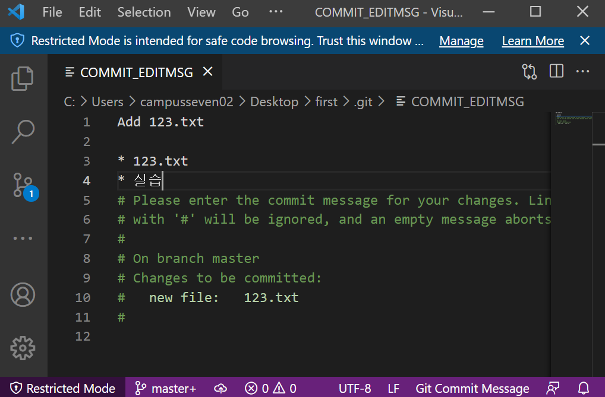

# gitconfig 

> Git 설정 파일

시스템, 글로벌, 로컬 설정을 각기 다르게 할 수 있으나 global 설정을 기본으로 설정

추후 프로젝트별로 다른 설정을 하고 싶다면 옵션을 `--global` 대신 `--local` 로 하면 된다.

## Global

> ~/.gitconfig 파일에 기록된 설정들

```bash
# 현재 설정 알아보기
$ git config --global -l
```

### 필수 

#### user 정보

Commit시 Author로 기록되기 위해서 초기에 설정할 필요가 있다.

```bash
$ git config --global user.email "edutak.ssafy@gmail.com"
$ git config --global user.name "edutak"
```

### 선택

#### credential (Github 인증 등)

```bash
$ git config --global credential.provider generic
```

* 현재 git bash 2.32에 발생된 버그를 해결하기 위함

#### 커밋 에디터 설정

> 기존 vim에서 vs code로 변경

```bash
$ git config --global core.editor "code --wait"
```



