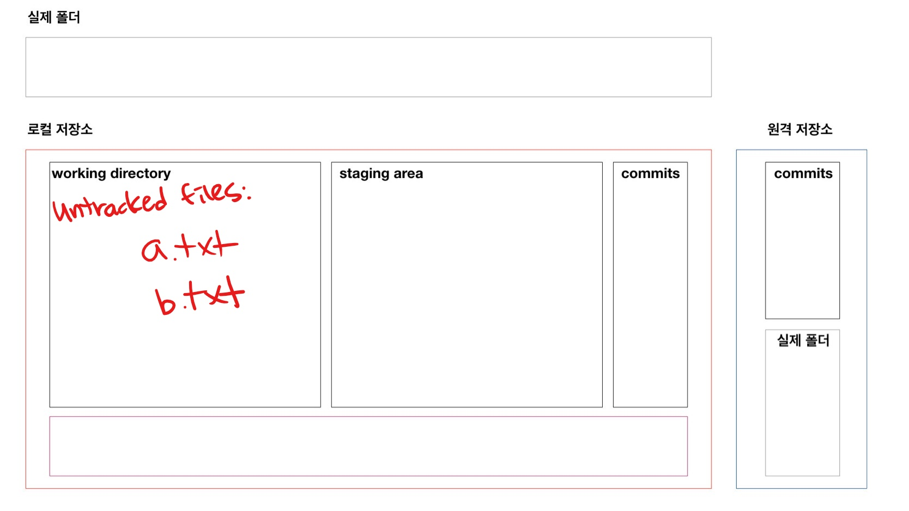
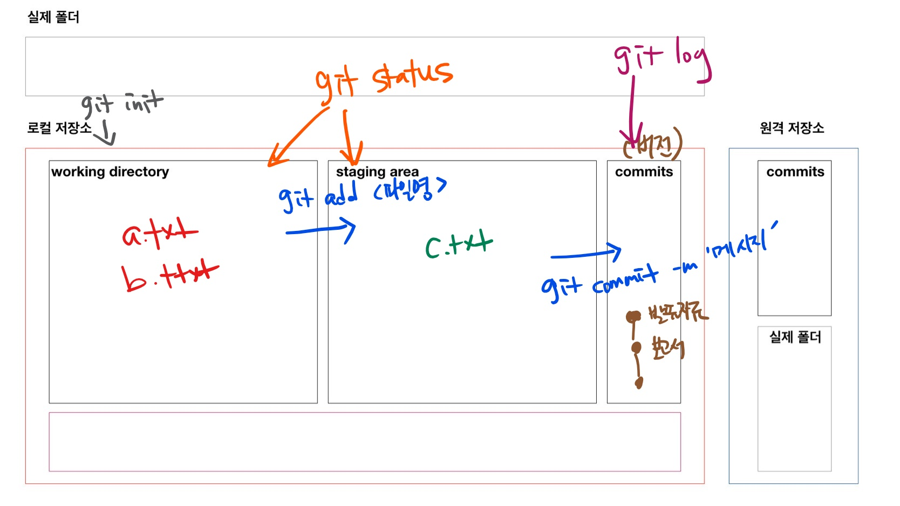

# git 기초

> 분산버전관리시스템(DVCS, Distributed Version Control System)

## git 설치

윈도우 환경에서는 기본적으로 git이 없어 git bash를 설치하여 활용한다. [설치 링크]()

## 기본 문법

### git 저장소 초기화(생성)

```bash
$ git init
Initialized empty Git repository in C:/Users/campusseven02/Desktop/test/.git/
(master) $
```

* `.git` 숨김 폴더에 git과 관련된 모든 정보가 담겨 있음

### add

```bash
$ git add <디렉토리>
$ git add a.txt # 파일 하나만
$ git add a.txt b.txt report.hwp # 여러 파일
$ git add my_folder/ # 특정 폴더
$ git add . # 현재 디렉토리 모든 파일/폴더
```

* `working directory` 의 변경사항을 `staging area` 상태로 변경

#### add 전

```bash
$ git status
On branch master

No commits yet
# 트래킹되고 있지 않은 파일들
# Working Directory
Untracked files:
# git add 를 사용
# 커밋될 것에 포함시키기 위하여..
# Staging area에 포함시키기 위하여..
  (use "git add <file>..." to include in what will be committed)
        a.txt
        b.txt
# 커밋될 것이 없다. (SA - X)
# 하지만, untracked files 있다. (WD - O)
nothing added to commit but untracked files present (use "git add" to track)
```



#### add 이후

```bash
$ git add a.txt
$ git status
On branch master

No commits yet

# 커밋이 될 변경사항들
# Staging Area O
Changes to be committed:
  (use "git rm --cached <file>..." to unstage)
        new file:   a.txt

Untracked files:
  (use "git add <file>..." to include in what will be committed)
        b.txt

```

### commit

```bash
$ git commit -m '커밋메시지'
[master (root-commit) 05ce7dc] Add a.txt
 1 file changed, 0 insertions(+), 0 deletions(-)
 create mode 100644 a.txt
```

* 커밋메시지는  버전을 나타낼 수 있도록 잘 작성해야 함
* 커밋 해시 값은 고유한 커밋을 나타냄
* 커밋 목록을 확인하기 위해서는 `git log ` 명령어를 사용

### status

```bash
$ git status
```

* Working directory, Staging area의 상태를 확인할 수 있음

### log

```bash
$ git log
commit 05ce7dc8c3149a63b98b7aeca99438a6728e8815 (HEAD -> master)
Author: edutak <edutak.ssafy@gmail.com>
Date:   Mon Jul 5 14:08:36 2021 +0900

    Add a.txt
$ git log --oneline # 한 줄로
05ce7dc (HEAD -> master) Add a.txt
$ git log -2 # 최근 2개
$ git log -2 --oneline # 한 줄로 최근 2개
```




